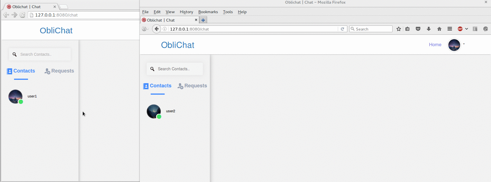

# Oblichat

**Oblichat** is chat web application which is really *oblivious*. In other words the web server forgets every message that is being sent.
The #1 rule of oblichat is to never save any messages. The communication between the users happens using web sockets, the server forwards the message to it's recipient and forgets about it.

 

 

**Oblichat** was made using `Node.js` + `sockets.io` + `pjax`. Right now this is only a very basic prototype to give you the general idea. In the upcoming versions each message will be encrypted with RSA, the private keys will be stored in the browsers of the users so the server side will not be able to see the contents by any means.

## Installation
Navigate to oblichat folder after the download and run `npm install`

## Usage
Open your browser and navigate to `http://localhost:8080`

### License

`Oblichat` is released under the MIT license.

### Dependencies

- Nodejs
- Socket.io
- MongoDB
- pjax

### Author

Stavros Moiras ([vipersec.com](http://vipersec.com))
