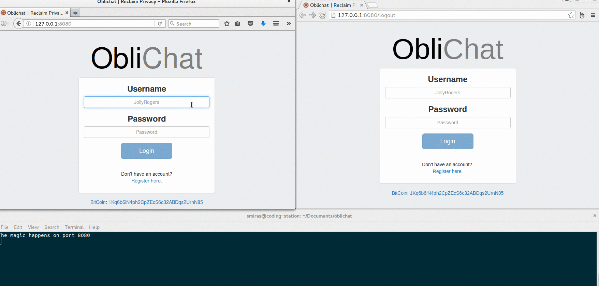

# Oblichat

**Oblichat** is chat web application which is really *oblivious*. In other words the web server forgets every message that is being sent (no message is ever recorder) and the browser forgets the messages everytime the user logs out.

I have implemented end-to-end encryption using RSA keys but what is most notable about this web application is that no one from the server side can ever decrypt the messages. The private key stays in the user's browser and it is never sent to the server.

The encryption and the decryption of the messages happens on the fly and it's completely transparent to the end user as you can in the example below (check the console window to see how the messages look like when they pass through the server).

<kbd>

</kbd>

**Oblichat** was made using `Node.js` + `sockets.io` + `pjax`. Right now this is only a very basic prototype to give you the general idea. In the upcoming versions each message will be encrypted with RSA, the private keys will be stored in the browsers of the users so the server side will not be able to see the contents by any means.

## Installation
Navigate to oblichat folder after the download and run `npm install`

## Usage
Open your browser and navigate to `http://localhost:8080`

### License

`Oblichat` is released under the MIT license.

### Dependencies

- Node.js
- Socket.io
- MongoDB
- pjax

### Author

Stavros Moiras ([vipersec.com](http://vipersec.com))
